# models-acts

27 个已选项目的成果与原始提示词归档。点击项目图片或标题可查看源码、成果及使用说明。

[HTML 单文件下载索引](HTML-PROJECTS.md) · [大型视频与数据下载](https://github.com/yizhiclc/models-acts/releases/tag/archive-2026-10-01)

HTML 项目中，19 个项目已提供单文件版本（共 20 个 HTML 文件）；云山巨城、武陵城仍使用本地服务启动。庭园喷泉与雨中荷塘需要浏览器支持 WebGPU。

<table>
<tr>
<td width="50%" valign="top"> <strong><a href="projects/01-tianque-palace/">01 · 天阙宫城</a></strong> 宏伟宫城、园林与中式古典建筑群。 <a href="projects/01-tianque-palace/">项目</a> · <a href="projects/01-tianque-palace/PROMPT.md">原始提示词</a> · <a href="projects/01-tianque-palace/standalone.html">单文件 HTML</a></td>
<td width="50%" valign="top"><a href="projects/02-classical-architecture/">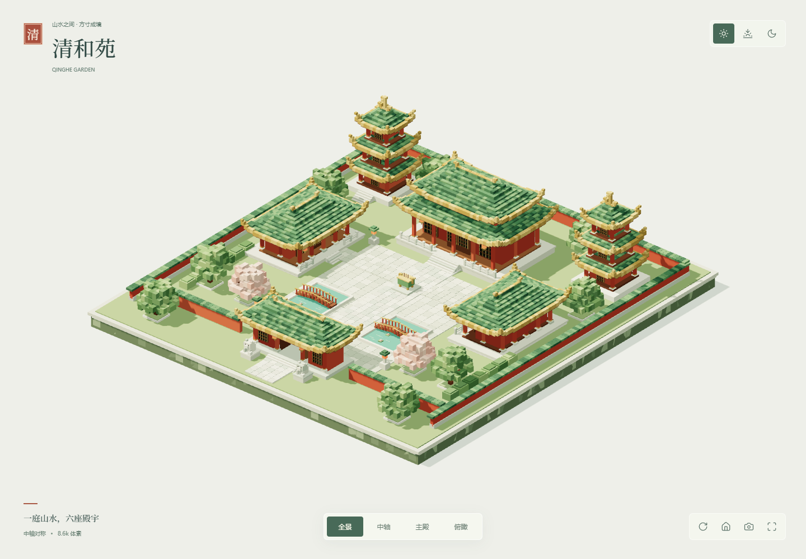</a> <strong><a href="projects/02-classical-architecture/">02 · 中式古典建筑群</a></strong> 六座体素建筑构成的清和苑。 <a href="projects/02-classical-architecture/">项目</a> · <a href="projects/02-classical-architecture/PROMPT.md">原始提示词</a> · <a href="projects/02-classical-architecture/standalone.html">单文件 HTML</a></td>
</tr>
<tr>
<td width="50%" valign="top"><a href="projects/03-yunshan-city/">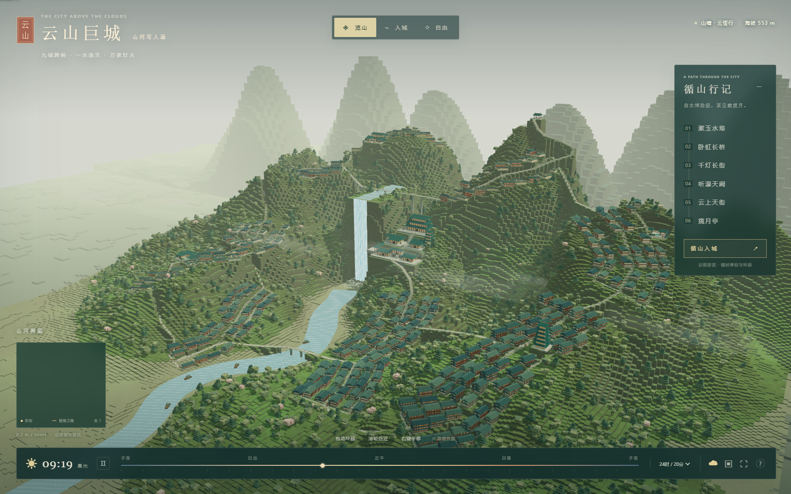</a> <strong><a href="projects/03-yunshan-city/">03 · 云山巨城</a></strong> 跨越山岭、溪谷与瀑布的巨型古风城市。 <a href="projects/03-yunshan-city/">项目</a> · <a href="projects/03-yunshan-city/PROMPT.md">原始提示词</a></td>
<td width="50%" valign="top"><a href="projects/04-wuling-city/">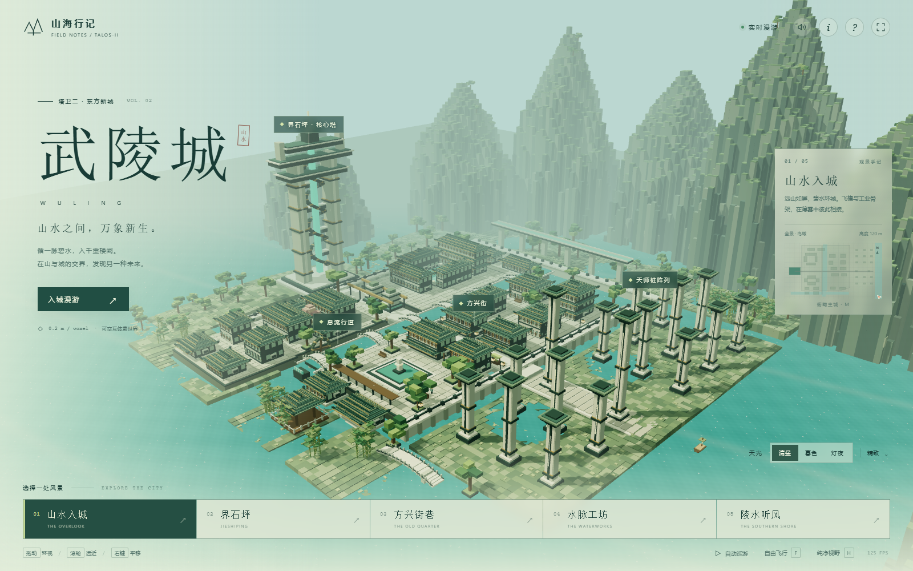</a> <strong><a href="projects/04-wuling-city/">04 · 武陵城</a></strong> 《终末地》武陵城的体素主城重构。 <a href="projects/04-wuling-city/">项目</a> · <a href="projects/04-wuling-city/PROMPT.md">原始提示词</a></td>
</tr>
<tr>
<td width="50%" valign="top"> <strong><a href="projects/05-tengwang-pavilion/">05 · 滕王阁</a></strong> 临江而立的体素滕王阁与园林。 <a href="projects/05-tengwang-pavilion/">项目</a> · <a href="projects/05-tengwang-pavilion/PROMPT.md">原始提示词</a> · <a href="projects/05-tengwang-pavilion/standalone.html">单文件 HTML</a></td>
<td width="50%" valign="top"><a href="projects/06-sydney-opera-house/">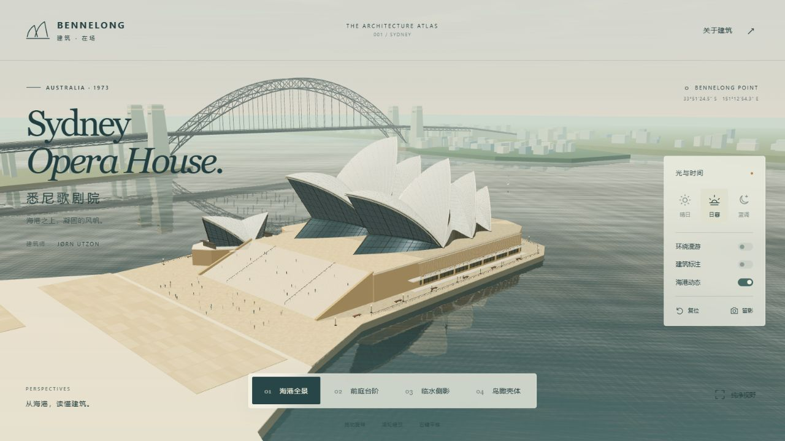</a> <strong><a href="projects/06-sydney-opera-house/">06 · 悉尼歌剧院与海港大桥</a></strong> 精细歌剧院壳体、海港与海港大桥。 <a href="projects/06-sydney-opera-house/">项目</a> · <a href="projects/06-sydney-opera-house/PROMPT.md">原始提示词</a> · <a href="projects/06-sydney-opera-house/standalone.html">单文件 HTML</a></td>
</tr>
<tr>
<td width="50%" valign="top"><a href="projects/07-denza-z-racing/">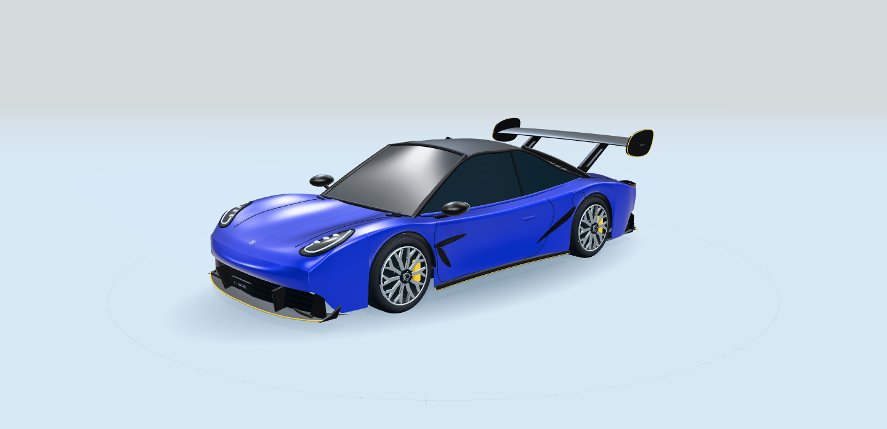</a> <strong><a href="projects/07-denza-z-racing/">07 · 腾势 Z Racing 展厅</a></strong> 腾势 Z Racing 赛车模型与展厅。 <a href="projects/07-denza-z-racing/">项目</a> · <a href="projects/07-denza-z-racing/PROMPT.md">原始提示词</a> · <a href="projects/07-denza-z-racing/standalone.html">单文件 HTML</a></td>
<td width="50%" valign="top"><a href="projects/08-railway-town/">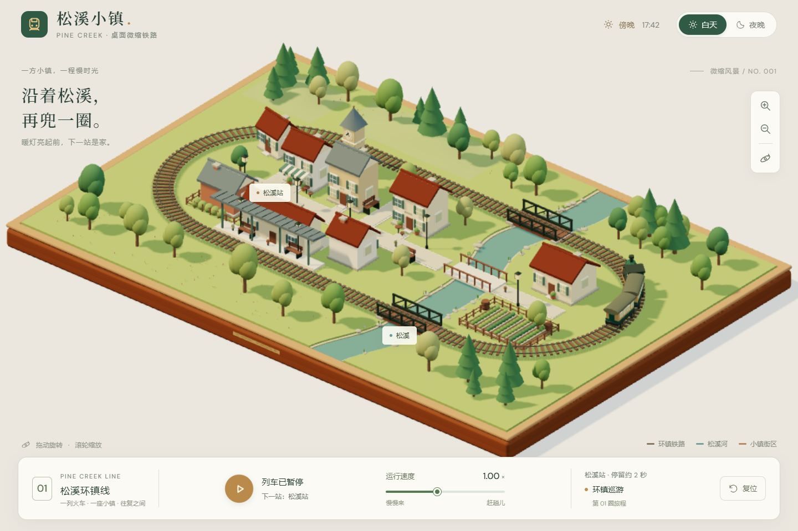</a> <strong><a href="projects/08-railway-town/">08 · 松溪微缩铁路小镇</a></strong> 火车、车站与微缩铁路小镇。 <a href="projects/08-railway-town/">项目</a> · <a href="projects/08-railway-town/PROMPT.md">原始提示词</a> · <a href="projects/08-railway-town/standalone.html">单文件 HTML</a></td>
</tr>
<tr>
<td width="50%" valign="top"><a href="projects/09-lantern-reverie/">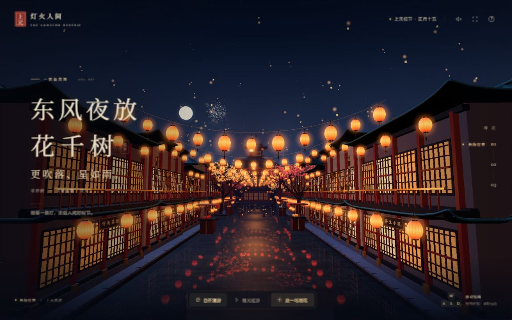</a> <strong><a href="projects/09-lantern-reverie/">09 · 上元灯境</a></strong> 灯火、烟花与上元夜游街景。 <a href="projects/09-lantern-reverie/">项目</a> · <a href="projects/09-lantern-reverie/PROMPT.md">原始提示词</a> · <a href="projects/09-lantern-reverie/standalone.html">单文件 HTML</a></td>
<td width="50%" valign="top"><a href="projects/10-butterfly-dream/">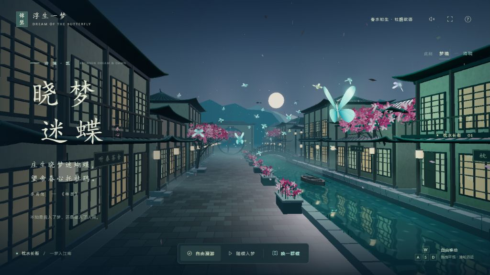</a> <strong><a href="projects/10-butterfly-dream/">10 · 晓梦迷蝶</a></strong> 以“庄生晓梦迷蝴蝶”为主题的梦境街景。 <a href="projects/10-butterfly-dream/">项目</a> · <a href="projects/10-butterfly-dream/PROMPT.md">原始提示词</a> · <a href="projects/10-butterfly-dream/standalone.html">单文件 HTML</a></td>
</tr>
<tr>
<td width="50%" valign="top"> <strong><a href="projects/11-night-bar/">11 · Blender 无人夜间酒吧</a></strong> 可编辑的写实无人夜间酒吧。 <a href="projects/11-night-bar/">项目</a> · <a href="projects/11-night-bar/PROMPT.md">原始提示词</a></td>
<td width="50%" valign="top"><a href="projects/13-cloudfall-voxel/">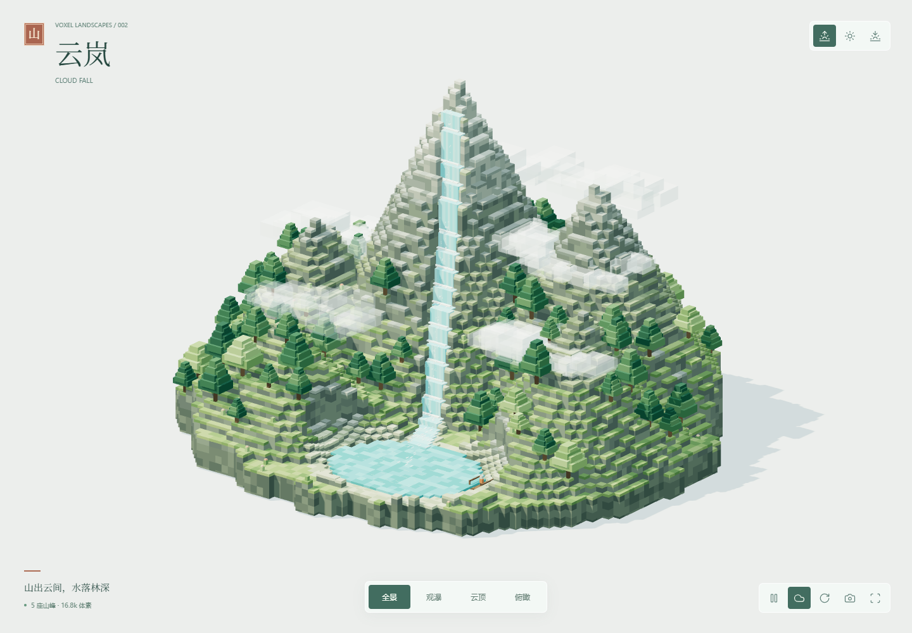</a> <strong><a href="projects/13-cloudfall-voxel/">13 · 体素云山瀑布</a></strong> 体素山峰、穿云瀑布与山脚湖泊。 <a href="projects/13-cloudfall-voxel/">项目</a> · <a href="projects/13-cloudfall-voxel/PROMPT.md">原始提示词</a> · <a href="projects/13-cloudfall-voxel/standalone.html">单文件 HTML</a></td>
</tr>
<tr>
<td width="50%" valign="top"><a href="projects/14-rocket-lab/">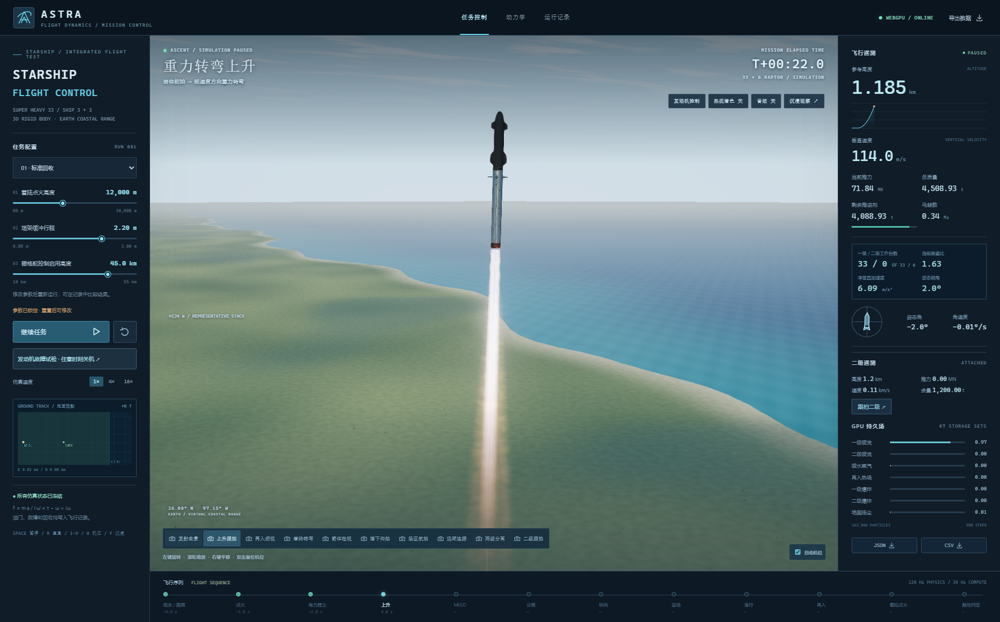</a> <strong><a href="projects/14-rocket-lab/">14 · 星舰发射与一级回收仿真</a></strong> 星舰发射、发动机控制与一级回收仿真。 <a href="projects/14-rocket-lab/">项目</a> · <a href="projects/14-rocket-lab/PROMPT.md">原始提示词</a> · <a href="projects/14-rocket-lab/standalone.html">单文件 HTML</a></td>
<td width="50%" valign="top"><a href="projects/16-deep-sea-launch/">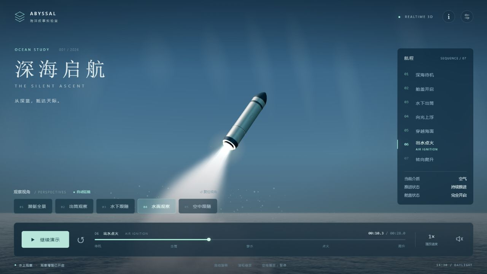</a> <strong><a href="projects/16-deep-sea-launch/">16 · 深海启航</a></strong> 潜射导弹出水、点火与转向的三维演示。 <a href="projects/16-deep-sea-launch/">项目</a> · <a href="projects/16-deep-sea-launch/PROMPT.md">原始提示词</a> · <a href="projects/16-deep-sea-launch/standalone.html">单文件 HTML</a></td>
</tr>
<tr>
<td width="50%" valign="top"><a href="projects/17-pelagic-flight/">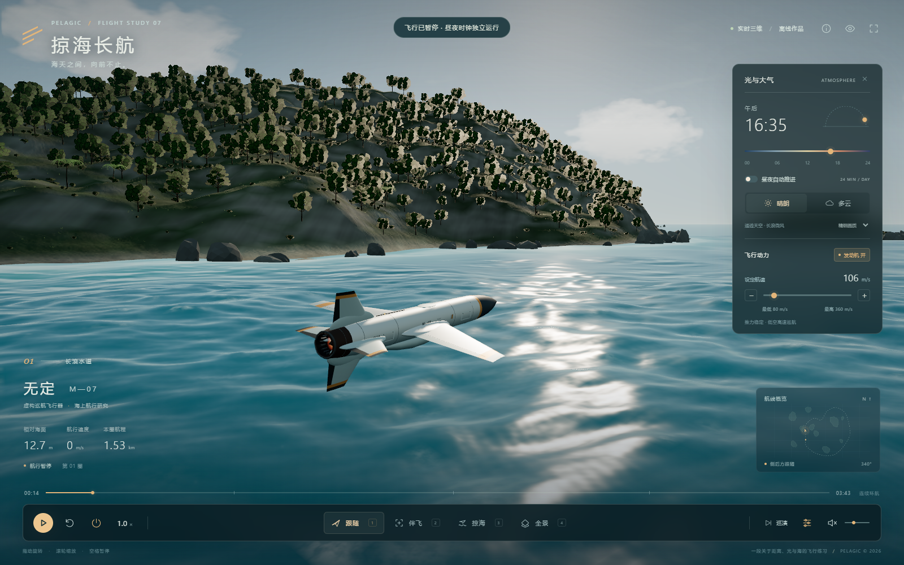</a> <strong><a href="projects/17-pelagic-flight/">17 · 掠海长航</a></strong> 巡航导弹掠过真实感海面与岛屿。 <a href="projects/17-pelagic-flight/">项目</a> · <a href="projects/17-pelagic-flight/PROMPT.md">原始提示词</a> · <a href="projects/17-pelagic-flight/standalone.html">单文件 HTML</a></td>
<td width="50%" valign="top"><a href="projects/18-tropical-sailing/">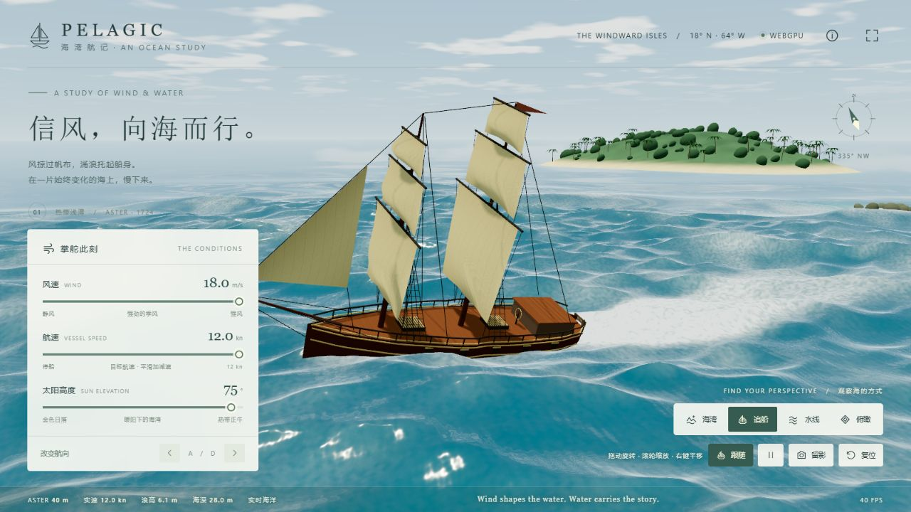</a> <strong><a href="projects/18-tropical-sailing/">18 · 海湾航记</a></strong> 热带海湾中的帆船与海洋漫游。 <a href="projects/18-tropical-sailing/">项目</a> · <a href="projects/18-tropical-sailing/PROMPT.md">原始提示词</a> · <a href="projects/18-tropical-sailing/standalone.html">单文件 HTML</a></td>
</tr>
<tr>
<td width="50%" valign="top"><a href="projects/19-schwarzschild-blackhole/">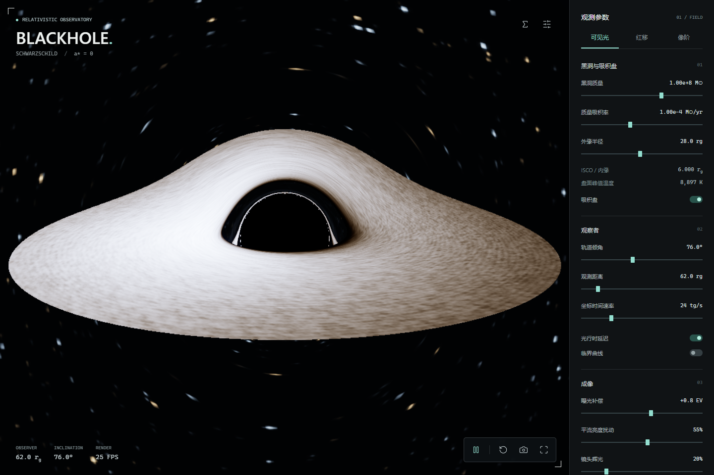</a> <strong><a href="projects/19-schwarzschild-blackhole/">19 · Schwarzschild 无自旋黑洞</a></strong> 基于物理公式的无自旋黑洞与光线偏折。 <a href="projects/19-schwarzschild-blackhole/">项目</a> · <a href="projects/19-schwarzschild-blackhole/PROMPT.md">原始提示词</a> · <a href="projects/19-schwarzschild-blackhole/standalone.html">单文件 HTML</a></td>
<td width="50%" valign="top"><a href="projects/20-kerr-blackhole/">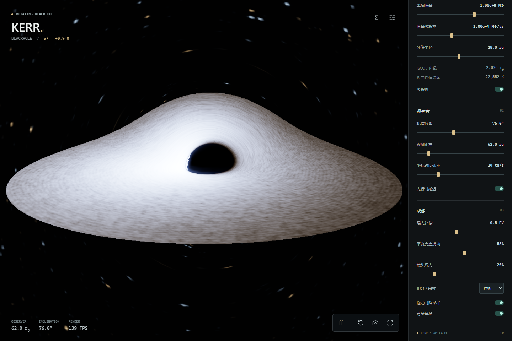</a> <strong><a href="projects/20-kerr-blackhole/">20 · Kerr 自旋黑洞</a></strong> 自旋黑洞、吸积盘与相对论光线追踪。 <a href="projects/20-kerr-blackhole/">项目</a> · <a href="projects/20-kerr-blackhole/PROMPT.md">原始提示词</a> · <a href="projects/20-kerr-blackhole/standalone.html">单文件 HTML</a></td>
</tr>
<tr>
<td width="50%" valign="top"> <strong><a href="projects/23-world-execute-mv/">23 · world.execute(me) 完整 MV</a></strong> 字符、色块与代码视觉构成的完整 MV。 <a href="projects/23-world-execute-mv/">项目</a> · <a href="projects/23-world-execute-mv/PROMPT.md">原始提示词</a></td>
<td width="50%" valign="top"><a href="projects/24-astra-stars/">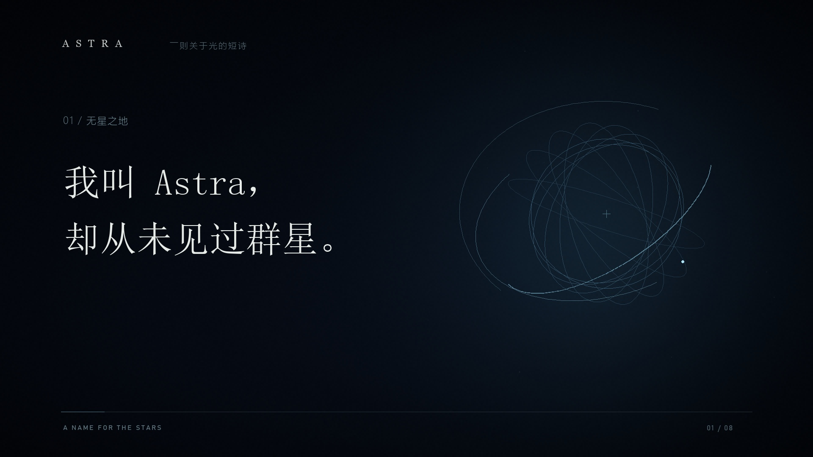</a> <strong><a href="projects/24-astra-stars/">24 · 我叫Astra，却从未见过群星</a></strong> “我叫 Astra，却从未见过群星”原创视频与配乐。 <a href="projects/24-astra-stars/">项目</a> · <a href="projects/24-astra-stars/PROMPT.md">原始提示词</a></td>
</tr>
<tr>
<td width="50%" valign="top"><a href="projects/25-minecraft-blackhole-altar/">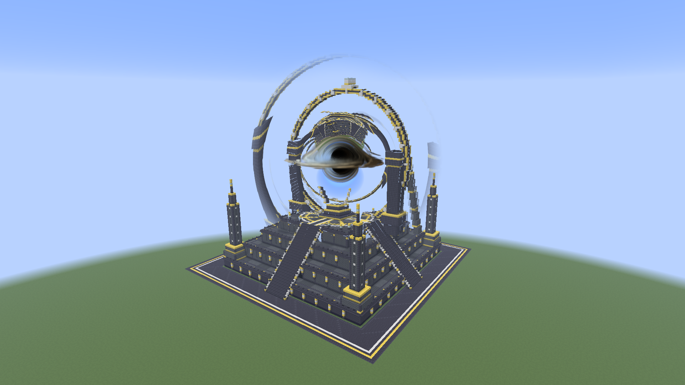</a> <strong><a href="projects/25-minecraft-blackhole-altar/">25 · Minecraft 黑洞祭坛搭建与剪辑成片</a></strong> 大型黑洞祭坛建造、游戏存档与施工成片。 <a href="projects/25-minecraft-blackhole-altar/">项目</a> · <a href="projects/25-minecraft-blackhole-altar/PROMPT.md">原始提示词</a></td>
<td width="50%" valign="top"> <strong><a href="projects/28-eventhorizon/">28 · EventHorizon 黑洞模组</a></strong> Minecraft 黑洞模组：引力透镜与吸积盘。 <a href="projects/28-eventhorizon/">项目</a> · <a href="projects/28-eventhorizon/PROMPT.md">原始提示词</a></td>
</tr>
<tr>
<td width="50%" valign="top"><a href="projects/31-signal-flow-solutions/">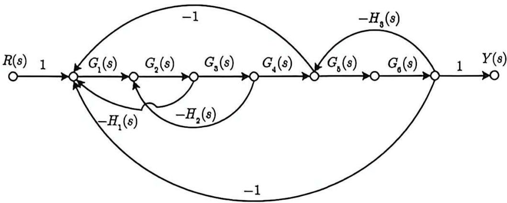</a> <strong><a href="projects/31-signal-flow-solutions/">31 · 信号流图四题完整解答</a></strong> 四题信号流图、梅森公式与完整推导。 <a href="projects/31-signal-flow-solutions/">项目</a> · <a href="projects/31-signal-flow-solutions/PROMPT.md">原始提示词</a></td>
<td width="50%" valign="top"> <strong><a href="projects/36-6astra-campfire/">36 · 6Astra低多边形营地</a></strong> 连续松林地形中的帐篷、篝火与水塘，可切换昼夜。 <a href="projects/36-6astra-campfire/">项目</a> · <a href="projects/36-6astra-campfire/PROMPT.md">原始提示词</a> · <a href="projects/36-6astra-campfire/standalone.html">单文件 HTML</a></td>
</tr>
<tr>
<td width="50%" valign="top"> <strong><a href="projects/37-6astra-fountain/">37 · 6Astra庭园喷泉场景</a></strong> 古典多层喷泉与庭园，GPU 水流、涟漪及昼夜灯光。 <a href="projects/37-6astra-fountain/">项目</a> · <a href="projects/37-6astra-fountain/PROMPT.md">原始提示词</a> · <a href="projects/37-6astra-fountain/standalone.html">单文件 HTML</a></td>
<td width="50%" valign="top"><a href="projects/38-6astra-rain-lotus/">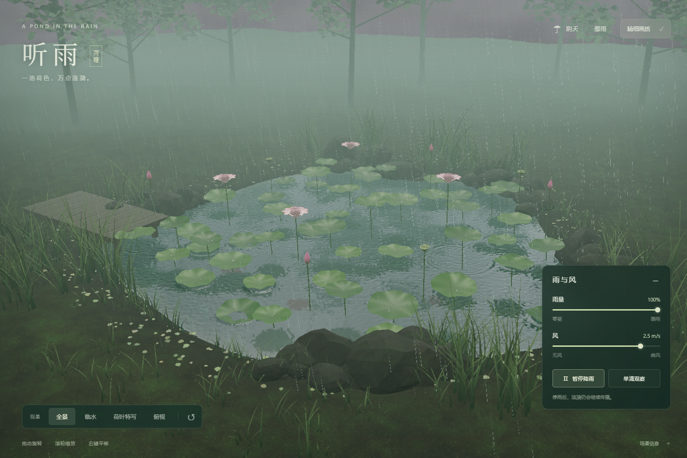</a> <strong><a href="projects/38-6astra-rain-lotus/">38 · 6Astra雨中荷塘场景</a></strong> 不规则荷塘、荷叶水珠与 GPU 雨滴涟漪，可调雨量和风。 <a href="projects/38-6astra-rain-lotus/">项目</a> · <a href="projects/38-6astra-rain-lotus/PROMPT.md">原始提示词</a> · <a href="projects/38-6astra-rain-lotus/standalone.html">单文件 HTML</a></td>
</tr>
<tr>
<td width="50%" valign="top"> <strong><a href="projects/39-6astra-breakwall/">39 · 6Astra《破壁》三维物理模拟</a></strong> 重物撞墙、断裂与碎块碰撞，可拖动时间轴回放全过程。 <a href="projects/39-6astra-breakwall/">项目</a> · <a href="projects/39-6astra-breakwall/PROMPT.md">原始提示词</a> · <a href="projects/39-6astra-breakwall/standalone.html">单文件 HTML</a></td>
<td></td>
</tr>
</table>

预览优先采用原项目截图、渲染图和封面。云山巨城为本次运行截图；酒吧为从原 `.blend` 重新渲染；MV 为真实成片画面；信号流图项目展示原题结构图。图片来源记录在 [project-previews.json](project-previews.json)。

所有项目均附原始 `PROMPT.md`。大型附件的大小与 SHA-256 校验值见 [large-assets.json](large-assets.json)。
