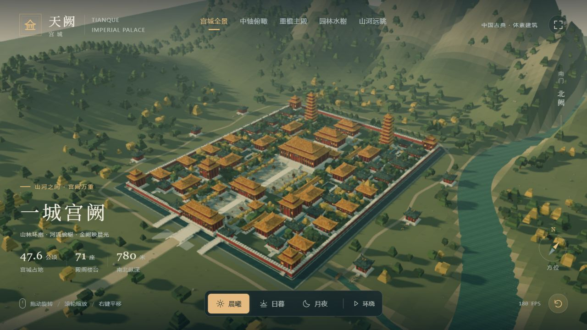

# 天阙宫城

*原项目全景截图。*

## 单文件 HTML

[单文件版本](standalone.html)

下载后双击 HTML 即可运行，无需安装或本地服务器。浏览器需要支持 WebGL。

文件来自原项目已交付的单文件版本，内容未修改。

[原始提示词](PROMPT.md) · [后续请求](REQUEST_HISTORY.md)

已找到的源码位于 `source/`（如有），交付文件位于 `deliverables/`。原项目中的使用与测试说明一并保留。本次仅归档，未重新运行作品。
