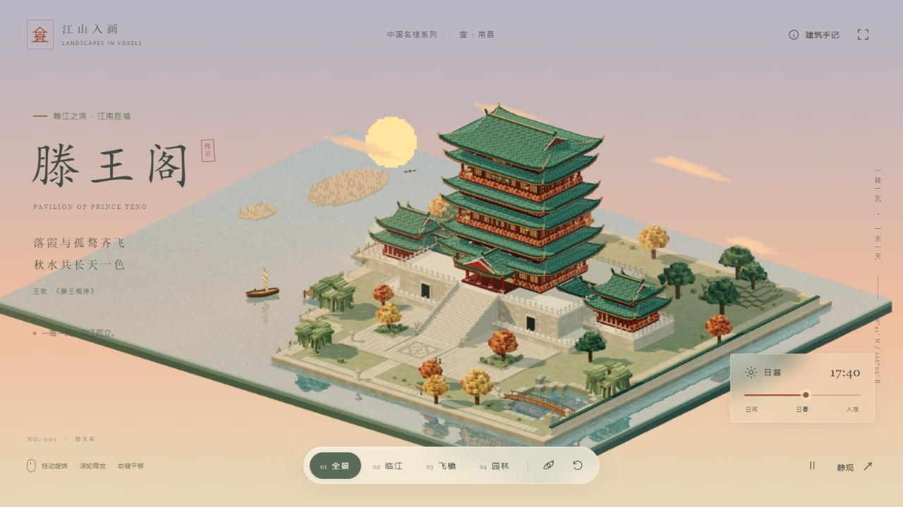

# 滕王阁 · 江山入画

一个可直接运行的 Three.js 体素微缩景观。默认于 17:40 的黄昏打开，以滕王阁、高台院落和赣江为完整构图。全部建筑、植物、舟鸟和环境由代码生成；页面运行不需要后端、模型下载、外部字体或图片服务。



## 安装与启动

需要 **Node.js 20.19+ 或 22.12+ 的现代版本**及 npm。在本项目目录运行：

```sh
npm install
npm run dev
```

终端会显示访问地址，默认为 **http://127.0.0.1:5173/**。浏览器打开后直接进入完整场景。此开发入口和普通多文件构建需通过 HTTP 服务访问。

## 单文件 HTML

另附的 **`滕王阁-单文件.html` 可直接双击，用现代浏览器离线打开**，无需安装 Node.js、启动服务器或联网加载资源。Three.js、控件、场景、样式和图标均已内嵌，保留完整交互。

修改源码后，在项目目录重新导出：

```sh
npm run build:single
```

文件生成在项目目录的上一层，名为 `滕王阁-单文件.html`。采用完整打包的普通脚本，支持 `file://` 本地打开；仍需浏览器支持 WebGL 2。

## 构建与成品预览

```sh
npm run build
npm run preview
```

构建结果位于 `dist/`，预览默认地址为 **http://127.0.0.1:4173/**。可将 `dist/` 部署至普通静态网站服务；构建使用相对资源路径，支持部署在子目录。项目不包含后台服务或数据收集。

压缩包同时附有此次已生成的 `dist/`；后续修改源码后请重新构建。

## 如何观看

| 操作 | 效果 |
| --- | --- |
| 鼠标左键拖动 / 单指拖动 | 围绕景观旋转 |
| 鼠标滚轮 / 双指捏合 | 缩放 |
| 鼠标右键拖动 / 双指拖动 | 平移 |
| 聚焦画面后按方向键 | 键盘平移 |
| 「全景」「临江」「飞檐」「园林」 | 切换四组经过构图的镜头 |
| 环游按钮 | 缓慢环绕，拖动画面即停止 |
| 复位按钮 / `R` | 恢复默认相机与缩放，保留当前时辰 |
| 时辰滑块 | 15:00—20:00 连续改变天空、日月、光照、水色与灯火 |
| 「日间」「日暮」「入夜」 | 直接切换至三个时段 |
| 暂停按钮 / 空格 | 暂停或继续舟鸟、水纹、云与环游 |
| 「静观」/ `H` | 收起或恢复界面 |
| 「建筑手记」 | 阅读建筑关系，并直接转至对应镜头 |
| `Esc` | 关闭手记或退出静观 |

浏览器若禁止全屏，可使用「静观」。系统启用减少动态效果时，默认暂停环境动画并立即切换镜头；仍可手动播放。

## 建筑与美术

- 以现存滕王阁的仿宋建筑形象为参考：朱柱、碧瓦、三层明楼与暗层交替，主阁六道屋檐与前抱厦形成七檐，高大双层台基配大阶和白石栏杆。
- 低翼亭阁与回廊水平展开，保持主阁的视觉统领。开阔的江岸园景围绕一个主院展开，包含垂柳步道、码头、洲渚、荷池、小桥、叠石、秋树与缓坡松林。
- 腰檐采用中空的环状屋面，楼身完整穿过屋顶；顶部具有歇山山花、阶梯化起翘、屋脊和吻兽。瓦块、斗拱、格窗、柱础、栏杆、石砌台基均为独立体素构件。
- 采用约 5.4 万个体素构件，主要结构通过 `InstancedMesh` 合并绘制。屋面体素约为 0.34 场景单位，保留可见阶梯和颗粒。
- 江面有实际实时平面倒影、轻微波动与碎金水纹；孤鹜、帆舟与缓慢流霞参与黄昏构图。
- 本作品是**基于现存形象的体素艺术演绎，并非测绘复原**。院落、地形和水岸经过缩景设计；时辰变化是美术化过渡，并非天文模拟。

建筑参考：[Pavilion of Prince Teng — Wikipedia](https://en.wikipedia.org/wiki/Pavilion_of_Prince_Teng)。未将参考照片打包或用作页面贴图。

## 项目组织

```text
src/
  main.js                    相机、控制器、帧循环、性能与生命周期
  ui.js                      界面、快捷键、时辰和建筑手记
  style.css                  界面与响应式排版
  scene/
    voxels.js                实例化体素、确定性随机数和程序化匾额
    architecture.js          主阁、环状腰檐、高台、阶梯、两翼亭廊
    landscape.js             地形、庭院、岸线、园林、舟与孤鹜
    atmosphere.js            天空、日月、光照、江水着色和时辰过渡
    river-reflection.js       适用于正交相机的反射预渲染
public/
  favicon.svg
```

## 运行说明

使用 Three.js WebGLRenderer，需现代浏览器支持 WebGL 2。实例化模型、共享几何、固定的反射纹理分辨率和仅随时辰更新的阴影控制开销。帧循环上限约 60 fps；较慢设备会自动降低像素比而保留模型。页面隐藏时停止绘制，返回时恢复。

验证记录见 [VERIFICATION.md](./VERIFICATION.md)。不同设备的帧率会有差异；不以开发环境测量代表所有硬件。
