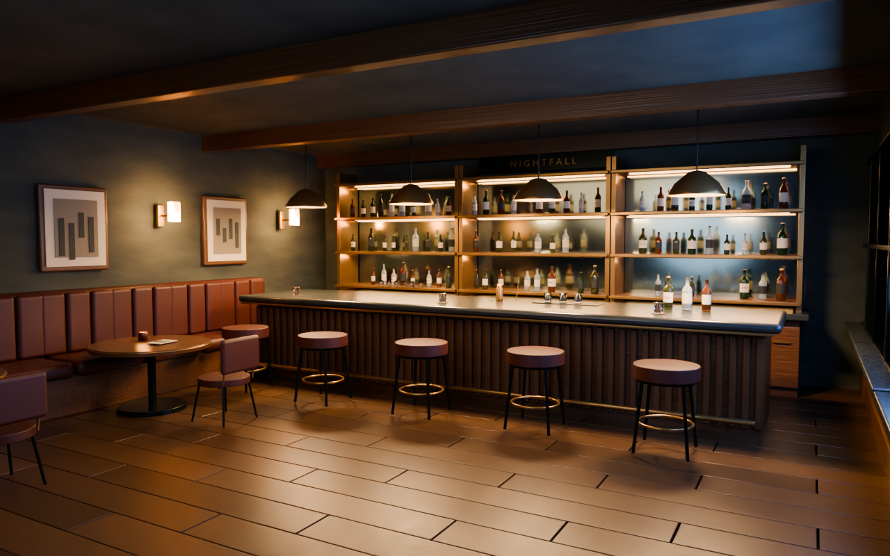

# Blender 无人夜间酒吧

*本次用原 .blend 文件重新渲染（Blender 5.2.2，Cycles，32 samples）。*

[原始提示词](PROMPT.md) · [原请求](REQUEST_HISTORY.md)

[下载可编辑 Blender 场景](deliverables/Nightfall_Empty_Bar.blend)。

这是原云端交付的文件，2026-10-01 由用户下载后提供。原记录显示使用 Blender 4.3.2，场景包含 763 个对象、712 个网格、20 个材质、21 盏灯和两台相机，采用程序化材质，无需外部纹理。本次已使用本机 Blender 5.2.2 打开原场景并渲染本页预览，原 .blend 文件保持不变。

原云端交付的两张预览图未包含在本次归档中；本页展示本次从原场景重新渲染的图片。
