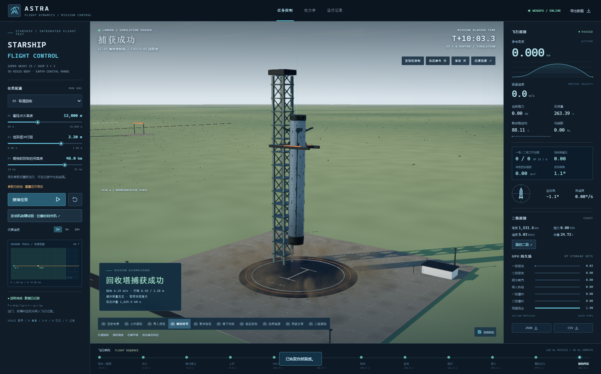

# ASTRA · Starship 飞行控制与回收仿真

Three.js **0.180.0** / WebGPURenderer / TSL compute / Vite。版本标记：`2026-09-30-starship-flight-control`。结构、纹理、图集、地球、天空和音效均由代码生成，运行时没有外部资源请求。

本版是可注入发动机故障的**三维六自由度两级仿真**。自动驾驶计算执行机构指令；位置、速度、三轴角速度和四元数由力与力矩积分得到。没有预存飞行轨迹、姿态关键帧或起降路径插值。相机跟拍和地面摆臂可以动画运动，它们不改写飞行状态。

采用代表性的 9 米直径 Starship / Super Heavy 外形：一级 **33 台**，二级 **3 台海平面机 + 3 台真空机**。包括约 71 米助推器、50 米飞船及 3 米连接环，程序几何从喷口到鼻尖约 124 米，不声称复刻某一批次硬件。回收采用有缓冲行程的塔架捕获模型。真实星舰的热分离、塔架接触细节、发动机参数和飞控软件没有被精确复现。


## 运行与操作

直接双击上一级目录的 **GPT6Astra max 火箭模拟.html**，或使用项目：

```sh
npm ci
npm run dev
# 打开终端给出的 http://127.0.0.1:5173

npm run build
# 生成 dist/index.html 和 ../GPT6Astra max 火箭模拟.html

npm run verify
# 重算五组飞行数据与 20 项数值检查
```

已在 Windows 夸克 **7.3.5.1009 / Chromium 144** 的 `file://` 单文件模式、实际 WebGPU 后端验证，没有强制启用 WebGPU 的浏览器参数。其他硬件和浏览器未作覆盖性兼容保证。若设备不提供 WebGPU，页面显示诊断信息；不会把空白画面标为在线，也不使用 WebGL 冒充 compute。

- 左键旋转、滚轮缩放、右键平移；双击复位机位。十个机位覆盖发射、跟拍、再入、塔架、检视、场区与二级。
- 空格开始/暂停，`R` 重来，`F` 沉浸观察，`Esc` 退出面板或沉浸，数字 `1–9 / 0` 切换机位。音效默认关闭。
- 可改着陆点火高度、塔架缓冲行程、栅格舵控制启用高度。飞行中修改配置供下次运行使用；发动机故障与手动油门可在本次运行中操作。
- “动力学”显示力矩、惯量、热流、阻力和燃料账本。“运行记录”保留最近八次的参数、命令和结果；浏览器禁止本地存储时仍保留当前页面内记录。
- “热流着色”是固定 `0–40 kW/m²` 的诊断假彩色，零热流为冷蓝色，超量程饱和。它不改变物理计算；分离后覆盖一级，未实现独立二级表面热图。

### 发动机故障与手动油门

面板中的每个编号对应独立推力源及 GPU 发射器。一级中心 B1–B3、中环 B4–B13 可摆动，外环 B14–B33 固定；二级 S1–S3 可摆动，S4–S6 为固定真空机。

点击编号多选，再“切断选中发动机”；也可逐台关机或全部关闭一级。支持上升/下降经过指定高度时关机，二级使用自身高度。命令记录请求时刻、执行时刻、实际高度、姿态及油量。暂停时命令排队，恢复后的物理步才作用于阀门。恢复按钮解除禁用，是否点火仍由任务阶段决定。

关闭 B2 并保留自动姿控，可看到其余机构补偿；关闭自动姿控再试，响应不同。更强的翻滚试验：在仿真 `t=55 s` 关闭 B15、B16、B17 并关闭自动姿控。三个角速度分量均来自推力偏心、气动力和刚体耦合。

分别勾选一级/二级手动油门，用滑条调节 `0–100%`。油门经阀门动态改变当前发动机组推力；禁用发动机始终不参与。从相同 `t=30 s` 状态分支，2 秒后：

| 油门 | 实际推力 | 净竖直加速度 |
|---|---:|---:|
| 30% | 22.502 MN | −4.820 m/s² |
| 60% | 45.000 MN | +0.209 m/s² |
| 90% | 67.501 MN | +5.266 m/s² |

证据：[manual-throttle-probes.csv](data/manual-throttle-probes.csv)。油门不足时，即使有尾焰也会减速；程序不维持预设加速度。

## 物理条款 1–7

### 1. 力矩 → 角速度 → 姿态

机体系 Y 指向鼻尖，绕 Y 为滚转；X/Z 为横向转动轴。状态为 body-to-world 四元数，顺序 `x,y,z,w`。对角惯量下：

```text
I · ωdot = τengine + τRCS + τfin + τaero − ω × (Iω)
Δrotation = (ωold + ωnew) / 2 · dt
qnew = normalize(qold ⊗ quaternionExp(Δrotation))
```

角加速度采用显式中点估计，四元数用指数映射更新，固定步长 `1/120 s`。发动机力矩逐台计算 `position × force`。目标四元数只用于求所需力矩，再由有摆角限制、响应速度限制的机构实现。固定喷口不参与摆角分配。阻力作用于等效压力中心，并有三轴转动阻尼。

起飞要求推力超过重量并解除发射台约束。平移满足 `a=(Fthrust+Fdrag)/m+g`，速度积分后用梯形平均更新位置。重力按距地心距离和方向计算。接触前不会把位置吸附到目标；接触时才施加显式冲量并消耗缓冲行程。

`quat* / omega* / alpha* / rotationStep* / torqueTotal* / gyroTorque* / integrationInertia*` 可审核积分。**三维旋转不能用三个欧拉角分别累加代替**：应检验相邻四元数差的对数映射与体轴角速度积分。`theta / roll / yaw` 只是辅助读数。数值测试对一级逐物理步审核力、位移、Euler 方程与四元数，并重新读取导出的 30 Hz 故障 CSV 做近似积分。

### 2. 质量与转动惯量共同变化

惯量由干体圆柱、等效推进剂圆柱和挂载二级的平行轴项计算，每步随油量重算 `inertiaX/Y/Z`。横向轴保留 1.2% 的代表性不对称，允许三轴耦合。推进剂离开时带走共转角动量，记录惯量运输项，不凭空因减重增加自转。

这是**固定等效质量参考点与对角惯量近似**，未动态求解真实质心移动、液面、晃动或非对角张量。分离验证了沿轴弹簧冲量的线动量平衡，未完整求解带偏置质心的多体角动量守恒。这些近似便于审核质量、惯量和控制因果，但限制工程精度。

### 3. 大气、阻力与跨声速异常

密度 `ρ=1.225 exp(−h/8500)`，压力采用 8400 米尺度高度。温度随高度下降后设下限，由此求声速。阻力为 `0.5 ρv² Cd A`，侧向迎风增加投影面积和有效 Cd。

基准 Cd 在 Mach 1 附近叠加高斯峰和超声速过渡项：低亚声速约 0.30，Mach 1 附近约 0.714，超声速外侧趋近 0.42。导出 `rho, pressure, sound, mach, cd, effectiveCd, area, drag`。[cd-mach-curve.csv](data/cd-mach-curve.csv) 与 [environment-probes.csv](data/environment-probes.csv) 验证等速高空阻力较低，Cd 存在峰值。

未实现分层标准大气、风、升力系数数据库或真实风洞标定。

### 4. 姿控机构与消耗

采用二维喷口摆动、动压限制下的栅格舵等效力矩、成对冷气 RCS。发动机主流量按 `F/(Isp·g0)` 扣除。RCS 按力矩、力臂和 72 秒等效比冲扣除；栅格舵及摆动伺服功率用 22% 效率换算为辅助供能的等效推进剂消耗。

`fuelMain / fuelRCS / fuelFins / fuelGimbal` 及二级对应列均属于同一账本。自然气动力和重力不是付费机构；燃料耗尽后仍可存在被动气动力矩，主动推力、RCS 和控制舵力矩归零。RCS 使用任务油量的等效质量扣账，没有隐藏的独立气瓶库存。

### 5. 热流同时依赖速度与密度

驻点热流近似为 `qdot=1.83e−4 sqrt(ρ/1.8) |v|³`，等效头部半径 1.8 米。同高速度加倍，指标增至八倍；同速提高高度，指标随密度平方根降低。`skinTemperature` 按发射率 0.8 求瞬时辐射平衡温度，**不是包含热容与导热的真实蒙皮温度**。

GPU 再入场由热流触发并演化；假彩色是独立诊断层，不将高度直接映射为红色。等速/等高探针见 `environment-probes.csv`。浏览器测试比较开关前后的实际 GPU 像素，并检查切换显示不改变 CPU 与存储场。

### 6. 塔架缓冲吸收冲量

Starship 外形改为塔架捕获，不使用旧版折叠腿。等效机构承载力 16 MN，结构载荷上限 25 MN，行程 `s` 可调。净承载力 `F−mg`，耗能容量 `(F−mg)s`，所需行程 `Ekinetic/(F−mg)`；停止时间由净冲量/净承载力求得，输出含重力作用的支撑冲量。

判定同时检查约 3 米捕获窗口、机构准备状态、倾角、侧向速度、结构载荷和容量。窗口外按随姿态变化的箭体/喷口最低点检测地面相交，倒着下落不会等到直立的接触高度。碰撞是事件式非弹性冲量，**不是逐杆弹簧阻尼求解器**；缓冲变形在事件中结算。

严格对照：默认和短行程试验触碰速度均为 **−6.18809384 m/s**，动能均约 **5.190 MJ**，所需行程 **0.38685637 m**。2.2 米行程成功，0.08 米失败，只有缓冲变量改变了结果。

### 7. 唯一推进剂账本

初始总推进剂 4,600,000 kg，其中一级 3,400,000 kg、二级 1,200,000 kg，存于一个权威 `fuel` 对象的两级分配池。分离后不跨级供料。每步统一结算主发动机、RCS 和供能需求；不足时按同一比例缩放对应力/力矩，储量不为负。

爆炸记录触碰前剩余量，再把 12% 记作燃烧、其余记作散逸，全部扣清。未分离坠毁同时结算两级，分离后二级可独立坠毁。默认完整飞行累计账本残差约 `1.5e−7 kg`。

## GPU 与 CPU 分工

CPU：120 Hz 两级刚体、地心重力、气动、阀门、推力分配、姿控、唯一燃料账本、接触判定和记录。自动驾驶是近似制导律，不代表真实星舰软件。

GPU：七个独立 storage 状态集合，覆盖五类效果，共 **163,840 个粒子槽位**。每四个物理步 dispatch 一次，即仿真时间 30 Hz。每套保存位置、速度、年龄、寿命、代数、活跃状态，跨帧推进。CPU 只提供边界条件，不逐帧上传粒子位置。

| 存储场 | 数量 | 触发与演化 |
|---|---:|---|
| 一级主喷流 | 65,536 | 33 个固定编号发射器；单机推力决定生成率和方向，继承机体速度及转动速度 |
| 二级喷流 | 24,576 | 6 个独立发射器；二级点火/油门/关机控制，海平面和真空喷口有独立压力参数 |
| 喷水蒸汽 | 24,576 | 倒计时及推力建立触发；喷水弹道、双向导流槽排流、浮升卷动和长寿命蒸汽 |
| 再入热场 | 8,192 | 下降热流触发，迎风生成、沿相对运动脱落、短寿命冷却 |
| 一级爆炸 | 24,576 | 只在失败触碰后触发一次；火球浮升和碎片弹道，尺度由实际能量决定 |
| 二级爆炸 | 8,192 | 独立二级碰撞，使用二级剩余量、动能、接触位置 |
| 地面扬尘 | 8,192 | 近地喷流动量触发；径向扩散、浮升、风漂、衰减，喷水抑制部分扬尘 |

这些是 GPU 持久粒子/场的近似，**没有求解 Navier–Stokes、可压缩激波网格或化学反应流**。马赫环、近喷口亮焰、折射和 Bloom 是辅助着色，不冒充独立 compute 场。

关机停止产生新粒子，已有粒子继续运动、冷却，解析焰芯亦有强度衰减。暂停后积分、账本、shader 仿真时间、GPU dispatch 一起停止；仍可移动相机或切换诊断图。恢复不会补算暂停期间的墙钟时间。

### 尾焰照片比对与能量特效

查看了 [Starship IFT-2 ascent](https://commons.wikimedia.org/wiki/File:Starship-IFT2-ascent.jpg) 的 2000×4000 发射照片，以及 [SpaceX 官方照片流](https://www.flickr.com/photos/spacex/)中的发射台照片。IFT-2 照片可见尾焰约为箭体两倍多；这里只参考视觉比例，未从曝光和投影反推真实长度，照片不打包进程序。

亮焰包络全油门最大约 322 米（真空机约 287 米），随单机强度的 0.7 次幂缩短，末端渐隐。GPU 混合尾流示踪速度为 `160+310·power m/s`、寿命约 `0.32–0.94 s`。这是卷吸后的视觉模型，**不是发动机有效喷速**，不反馈推力计算。颜色从近喷口白蓝过渡到下游淡橙，冲击单元逐渐减弱。

扩张角来自喷口出口压/环境压，低空较窄，高空展开，低环境压下马赫环对比度下降。GPU 读回在 1.18 km 与 63.96 km 高度、喷口后 35–80 米区间的平均径向距离约 3.06 米和 11.00 米。低空粒子下游距离第 95 百分位约 343 米，包含很暗的末端粒子，不等于照片可见亮焰长度。

再入颜色使用经验温度映射，未实现光谱黑体积分。爆炸能量 `E=0.5mv²+0.5ω·Iω+剩余推进剂×50 MJ/kg×0.12`；半径和碎片范围随立方根增长，时长随对数增长。50 MJ/kg 为等效参数，爆炸半径是视觉尺度，不是伤害半径预测。

## 数据与复现

所有时间以喷水序列开始为 `t=0`，界面为 `t−8 s`。SI 单位，角度为弧度。`altitude` 为距球面参考高度再减去 55 米初始质心高度，因此待命为零；`x,y,z` 保留原始位置。分离后的 `mass` 指一级，`upperMass` 指二级；`propellant` 指任务总剩余量，另有两级各自储量。

| 数据组 | 结果 / 目的 | 主要结果 |
|---|---|---|
| [successful-landing](data/successful-landing.json) | 标准成功回收 | MECO 86.02 km；分离 91.33 km；一级远地点 268.57 km；触碰 t=610.617 s |
| [short-stroke-crash](data/short-stroke-crash.json) | 同速度、0.08 m 行程坠毁 | 与成功组触碰速度完全相同；爆炸约 380.37 GJ |
| [late-ignition-crash](data/late-ignition-crash.json) | 80 m 才点火 | 竖直触碰速度 −687.49 m/s；爆炸约 951.66 GJ |
| [engine-out-tumble-crash](data/engine-out-tumble-crash.json) | B15–B17 关机，姿控关闭 | 三轴翻滚，未分离坠毁，两级油量同时结算 |
| [ship-engine-cut-crash](data/ship-engine-cut-crash.json) | 二级六机 t=175 s 关闭 | 一级成功；二级 t=627.592 s 独立坠毁 |

每组都有同名前缀的 **机体 `.csv`、逐机 `-engines.csv`、元数据 `.json`**。JSON 引用同目录时间序列，避免重复保存几百 MB 数据。运行时“JSON”按钮可导出含全部数组的单份数据；“CSV”下载三份文件。

机体按 30 Hz、逐台发动机按 10 Hz 导出，额外保留事件物理步；解算仍为 120 Hz。事件导致非均匀采样，应使用实际相邻时间差。

关键字段：

- `quat* / omega* / inertia*`：姿态与变惯量，二级加 `upper` 前缀。
- `stepThrustWorld* / stepDragWorld* / stepGravity* / integrationMass`：实际步内平移输入。
- `stepEngineTorque* / stepRCSTorque* / stepFinTorque* / appliedAeroTorque*`：步内力矩来源。`torqueAero*` 是步末重算值，严格审计应使用 `appliedAeroTorque*`。
- `rho / mach / cd / drag / heatFlux / skinTemperature`：阻力峰、热流及辐射平衡指标。
- `fuel* / boosterPropellant / upperPropellant`：燃料总账、控制消耗、爆炸散逸。
- 每个场的 `Intensity / Emission / TriggerAt`：强度、生成源、首次触发；JSON `activations` 保存重新触发记录。
- 逐机 CSV：编号、允许状态、阀门、推力、二维摆角、三轴力/力矩、累计用量、强度及触发时间；JSON `engines` 给固定安装位置。
- `impactKineticEnergy / impactRemainingPropellant / impactChemicalEnergy / impactNetImpulse / impactGroundImpulse / bufferCapacity / strokeRequired / explosionEnergy / blastScale / blastRadius / blastDuration / debrisRange`：碰撞后逐行可追溯结果。二级碰撞详见 JSON `upper.touchdown` 与事件。
- JSON `engineCommands / scheduledCommands / events` 保存人为干预；`config` 保存参数，CSV 也重复写入主要配置列。
- 浏览器导出的 `visualization.plumeModel / exhaustEnvelopes` 保存长度公式、当前逐机光学参数，`gpuEvidence` 是实际 buffer 读回。CPU 生成数据明确标记没有附加 GPU；实测另见浏览器报告。

无有限停止行程的接触会给出 Infinity；JSON 中非有限数编码为 `null`，应结合失败原因读取，不能解释为零行程。

### 验证记录

[validation-report.json](data/validation-report.json) 含 20 项 CPU 验证和五组飞行数据：逐步力/力矩、四元数、总账、偏心推力、自动补偿、油门、零油量、60/120/240 Hz 比较、写出后重新读入 CSV。没有逐步审核二级全部方程残差；二级覆盖独立点火、姿态渲染对应、油量、关机与碰撞。

浏览器报告使用真正的 WebGPU 存储或像素读回：

- [quark-starship-validation.json](data/quark-starship-validation.json)：完整回收、二级故障、七场、尾流长度/扩张、马赫环、连接、热图、暂停。
- [quark-engine-validation.json](data/quark-engine-validation.json)：单机切断/恢复、全关、高度触发、手动油门、三轴运动和独立喷流消退。
- [quark-standalone-validation.json](data/quark-standalone-validation.json)：file://、完整短行程坠毁、爆炸、三文件导出、零联网。
- [quark-rendering-validation.json](data/quark-rendering-validation.json)：多窗口/像素比首帧和点火，以及注入空白绘制/GPU 错误后的诊断与冻结。

有 Playwright 的环境可执行可选浏览器检查：

```sh
npm run verify:browser
npm run verify:engines
npm run verify:standalone
npm run verify:rendering
```

`PLAYWRIGHT_MODULE` 可指定模块位置，`BROWSER_EXECUTABLE` 指定夸克/Chromium，`STANDALONE_HTML` 指定文件，`BROWSER_TEST_ID` 指定报告前缀；默认使用 Playwright Chromium 和 dist/index.html。

## 完成范围

| 条款 | 状态 | 说明 |
|---|---|---|
| 1 | 实现并验证 | 三维力矩积分；固定参考点等精度限制见上文 |
| 2 | 实现并验证 | 油量、质量、三轴惯量一起变化 |
| 3 | 实现并验证 | 密度/速度阻力、跨声速 Cd 峰 |
| 4 | 实现并验证 | 喷口、RCS、舵机消耗进入同一账本 |
| 5 | 实现并验证 | 热流依赖 sqrt(ρ)·v³，GPU 场与表面诊断 |
| 6 | 实现并验证，机构改为捕获塔 | 同速度行程对照；事件冲量近似 |
| 7 | 实现并验证 | 唯一库存、两级分配、无油不产生主动控制 |
| 8 | 实现并验证 | 五类别、七 GPU 持久状态集合；不宣称 CFD |
| 9 | 部分实现 | 压力扩张、马赫环、能量相关爆炸；非光谱黑体着色 |
| 10 | 实现并验证 | 完整一级流程；二级独立动力飞行 |
| 11 | 实现并验证 | 时间序列、配置、事件、命令及接触能量导出 |
| 12 | 实现并验证 | 两级、账本、七场一起冻结，暂停指令排队 |
| 13 | 实现并验证 | 点火高度和缓冲行程对照；另有舵控制高度、手动油门 |
| 14 | 实现并验证 | 自由相机、复位、重复运行及比较 |
| 发射仪式与场景 | 实现，外形近似 | 摆臂/脐带撤离、导流槽、动态灯光、震动、程序化海岸与地球 |
| 星舰型号真实性 | 部分实现 | 33+6 拓扑、黑瓦、襟翼、焊缝、管路、捕获塔；未标定到某批真实硬件 |

未实现：真实热分离耦合、稳定轨道任务、飞船返回与 belly-flop 回收、地球自转/Coriolis、真实风场、推进剂晃动、结构弹性破坏、移动质心多体模型、材料热传导、工程级可压缩 CFD。默认二级的高远地点不代表“已入轨”。海岸和洲际地图是代码生成近似，不是 Starbase 测绘数据。



## 源码入口

`physics.js / rigid-body.js / vehicle.js`：动力学与发动机；`effects.js`：GPU compute；`plume-model.js / exhaust.js / thermal.js / cinematic.js`：尾焰、光学与热诊断；`starship-model.js / coastal-world.js / details.js / surfaces.js`：结构和环境；`engine-control.js / main.js`：监控、指令和导出。`scripts/` 为复现工具，`data/` 为本版证据。
