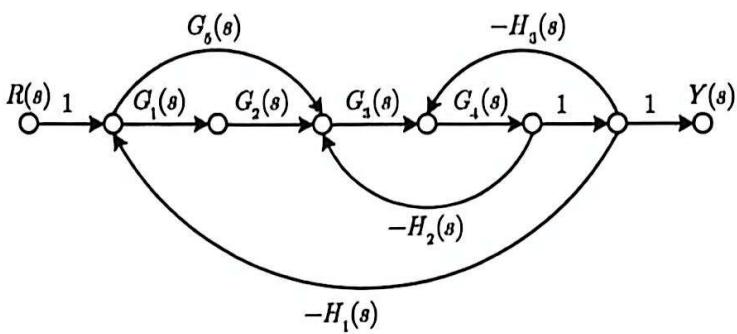
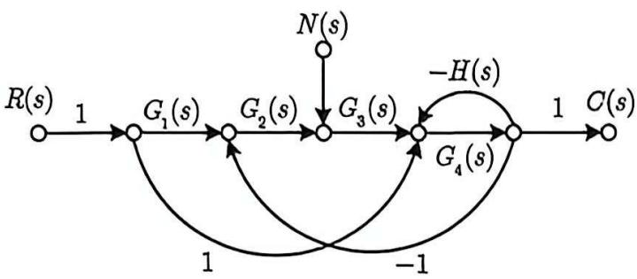
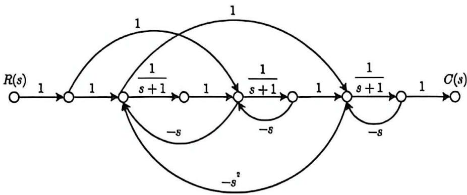

# 专业课题目汇总（信号流图）

共 4 道题。题干与题图均在本文件与 `images/` 内，直接整个 `题目` 文件夹拷走即可使用，无需其它文件。

---

## 题图索引

| 题号 | 题目 | 题图 |
| --- | --- | --- |
| 第 1 题 | 已知信号流图求传递函数（含互不接触回路） | `images/图01-1.jpg` |
| 第 2 题 | 已知信号流图求传递函数（多回路） | `images/图02-1.jpg` |
| 第 3 题 | 双输入信号流图求 C(s)/R(s) 与 C(s)/N(s) | `images/图03-1.jpg` |
| 第 4 题 | 复杂信号流图求传递函数 | `images/图04-1.jpg` |

---

### 第 1 题　已知信号流图求传递函数（含互不接触回路）

试用梅森公式求解图所示系统信号流图的传递函数 $\dfrac{Y(s)}{R(s)}$。

---

### 第 2 题　已知信号流图求传递函数（多回路）

已知某系统的信号流图如图所示，试确定传递函数 $\dfrac{Y(s)}{R(s)}$。

---

### 第 3 题　双输入信号流图求 C(s)/R(s) 与 C(s)/N(s)

已知某系统的信号流图如图所示，试求 $\dfrac{C(s)}{R(s)}$ 和 $\dfrac{C(s)}{N(s)}$。

---

### 第 4 题　复杂信号流图求传递函数

某系统的信号流图如下图所示，求系统的传递函数 $\dfrac{C(s)}{R(s)}$。

---
