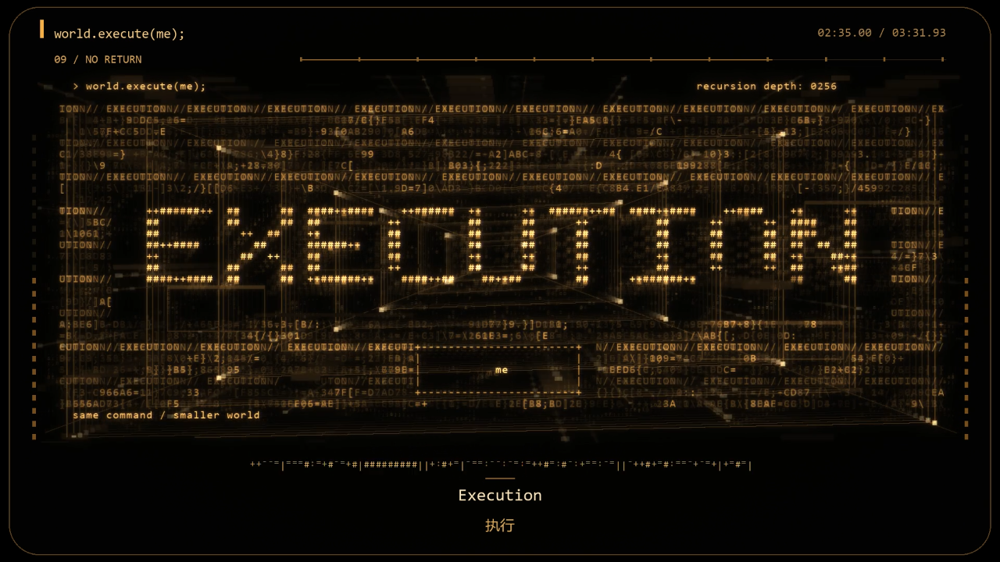

# world.execute(me) 完整 MV

*增强版成片 02:35 画面。*

[原始提示词](PROMPT.md) · [后续请求](REQUEST_HISTORY.md)

保留三版完整视频。源代码及 Demo 已按原请求清理，本次归档不声称包含源码。

已找到的源码位于 `source/`（如有），交付文件位于 `deliverables/`。原项目中的使用与测试说明一并保留。本次仅归档，未重新运行作品。

## 大型成果下载

| 文件 | 大小 | 下载 |
|---|---|---|
| 23-world-execute-abstract-mv.mp4 | 489.7 MiB | [下载](https://github.com/yizhiclc/models-acts/releases/download/archive-2026-10-01/23-world-execute-abstract-mv.mp4) |
| 23-world-execute-enhanced-mv.mp4 | 212.5 MiB | [下载](https://github.com/yizhiclc/models-acts/releases/download/archive-2026-10-01/23-world-execute-enhanced-mv.mp4) |
| 23-world-execute-full-mv.mp4 | 103.9 MiB | [下载](https://github.com/yizhiclc/models-acts/releases/download/archive-2026-10-01/23-world-execute-full-mv.mp4) |

文件大小与 SHA-256 校验值见仓库根目录的 [large-assets.json](../../large-assets.json)。
