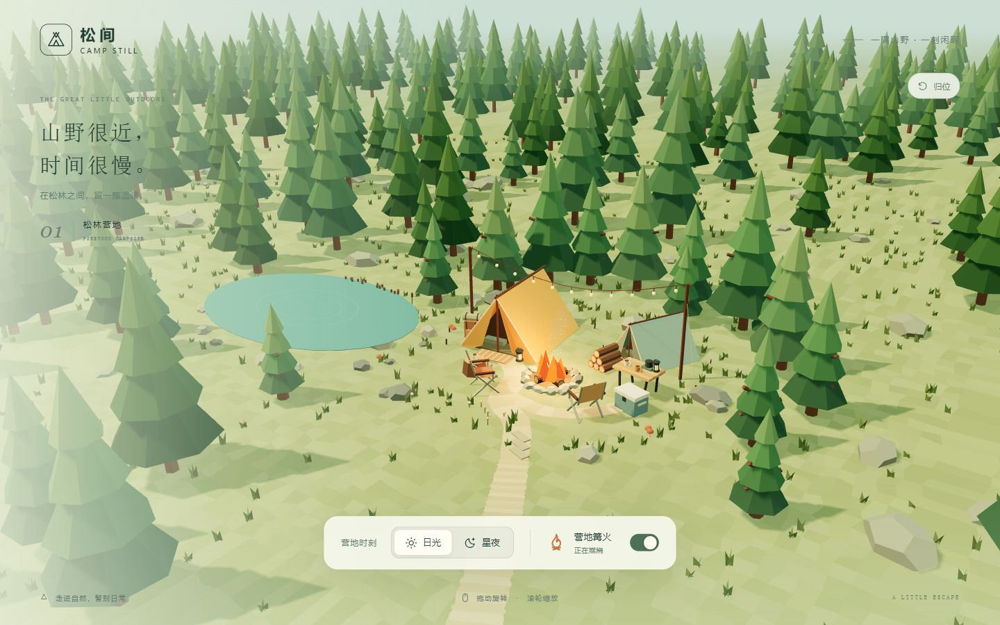

# 24 · 6Astra低多边形营地

*原项目测试截图（2026-10-02）。*

连续松林地形中的帐篷、篝火与水塘，可切换昼夜。

- [下载单文件 HTML](standalone.html)：打开文件页，点击 **Download raw file**，下载后用浏览器打开。
- [完整项目包](deliverables/GPT-6-Astra%20max%20%E7%AF%9D%E7%81%AB%E8%90%A5%E5%9C%B0-%E5%AE%8C%E6%95%B4%E9%A1%B9%E7%9B%AE.zip)：包含源码、依赖锁文件、许可与原测试记录。
- [原始提示词](PROMPT.md) · [后续请求原文](REQUEST_HISTORY.md)
- [完整使用说明](source/README.md) · [原项目测试记录](source/TEST-RESULTS.md)

使用支持 WebGL 2、已开启硬件加速的现代浏览器。可旋转、缩放，切换日光 / 星夜和篝火。

`standalone.html` 与原交付 HTML 逐字节一致，运行所需脚本和样式均已内嵌。新项目的 HTML 与预览图校验值记录在仓库索引中。

源码位于 `source/`，未包含 `node_modules`；重新构建前请按源码说明安装依赖。原聊天标题为“6Astra低多边形营地”，归档日期为 2026-10-02。此处保留的是原项目测试结果，本次归档未重新执行全部场景测试。
