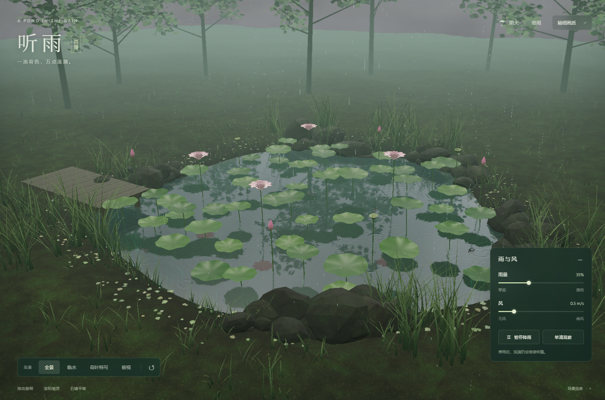
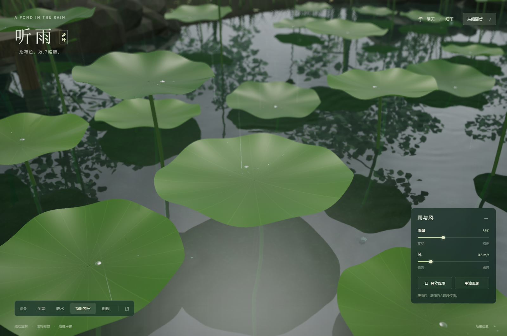

# 听雨 · 雨中荷塘

一个无需后端的 Three.js / WebGPU 交互场景。打开页面即进入阴天细雨中的荷塘。池岸采用不规则曲线，连接起伏泥坡、岸草、石块、林木和木栈道；植物、材质贴图、天空和水面均由代码生成，不下载模型、HDR 或照片。





## 安装与启动

需要 Node.js **20.19+ 或 22.12+**，以及支持 WebGPU 的浏览器与显卡驱动。建议使用开启硬件加速的 Chrome / Edge，通过 `localhost` 或 HTTPS 访问。

```sh
npm ci
npm run dev
```

打开终端输出的本地地址。生产构建与预览：

```sh
npm run build
npm run preview
```

`three` 固定为 **0.180.0**，并提供 `package-lock.json`。代码使用这个版本的 WebGPU 后端桥接接口，因此升级 Three.js 后需要重新验证。WebGPU 不可用、设备丢失或着色器编译失败时，会显示错误说明和重试按钮，不以空白画面代替提示。

### 单文件 HTML

```sh
npm run build:single
```

会在项目的上一级目录生成 `rain-lotus.html`。Three.js、业务脚本、计算着色器、CSS 和许可文本全部内嵌，场景无需网络资源。支持本地文件 WebGPU 的 Chrome / Edge 可直接打开这个 HTML；仍需浏览器支持 WebGPU 并开启硬件加速。如果浏览器限制 `file://` 下的 WebGPU，可把同一文件放到 localhost 或 HTTPS 下访问。

## 操作

| 操作 | 效果 |
| --- | --- |
| 左键拖动 / 单指拖动 | 旋转视角 |
| 滚轮 / 双指缩放 | 拉近与拉远 |
| 右键拖动 / 双指平移 | 平移观察中心 |
| 全景、临水、荷叶特写、俯视 | 平滑切换机位和对焦距离 |
| 雨量 | 连续改变雨滴数量、粒径分布、水面扰动、叶面来水量、粗糙度及雾浓度 |
| 风 | 改变雨线倾角、水面细波与荷叶摆动 |
| 暂停降雨 / 空格 | 停止连续雨滴，保留已有波场与叶面水珠；有风时仍有风生细波 |
| 单滴观察 | 停雨并设为无风；按钮或点击开阔水面产生一个真实下落的大雨滴 |
| 精细画质 | 提高反射和折射分辨率，静止约 0.42 秒后进行时域多帧累积；移动相机立即重置历史 |
| 复位 / R | 回到全景机位 |
| 场景信息 | 查看帧率、水珠数量、渲染状态 |

观察波行为时，建议选择“临水”或“俯视”，进入单滴模式后点击空旷水域。降雨暂停不会清空高度或速度。叶上已经积存的水仍可能继续滴落。

## 尺度与植物

坐标单位为米。数值域为 8 × 8 米，实际水域为约 7 米宽的不规则池塘，水深最多约 0.55 米。岸线由同一解析函数生成，供地形、水面裁切和波动障碍共同使用，矩形计算网格不会呈现为矩形池岸。

荷叶直径约 0.38–0.58 米，有中央凹陷、径向叶脉、波浪形薄边及轻微不对称。茎秆从水下泥床连接到叶片中央下方，叶片升降会同步调整茎长。荷花有多层参数化花瓣、花蕊、闭合花苞和莲蓬。植被成簇分布，在水面之间保留可观察涟漪和倒影的空隙。

## 持久 GPU 波场

`src/wave.wgsl` 在 **512 × 512** 网格上保存水面高度 `h` 和竖直速度 `v`，空间步长 **1.5625 厘米**，固定时间步长 **1/120 秒**。两块存储缓冲区交替读写，状态跨帧保留。连续高度场产生传播、叠加、干涉及反射；渲染没有给每个落点播放独立的圆环动画。

离散模型为带表面张力项的阻尼波动近似：

```text
∂h/∂t = v
∂v/∂t = c² ∇²h − κ ∇⁴h + ν ∇²v − γv + 雨滴冲量 + 风力
c = 0.23 m/s
κ = 2.4 × 10⁻⁷ m⁴/s²
ν = 2.8 × 10⁻⁵ m²/s
γ = 0.38 s⁻¹
```

使用五点拉普拉斯、双拉普拉斯及半隐式欧拉时间更新。雨滴向速度场原子累加一个近似零均值的 7 × 7 冲量核，强度按雨滴体积和入水速度变化。计算之后，另一 GPU pass 将高度及梯度写入 `rgba16float` 纹理，直接用于水面顶点位移、反射和折射法线。

该模型是经过尺度校准的毛细重力波近似，并不是完整的不可压缩流体求解。稳定可辨的波长约 **6 厘米及以上**；低于两格的毫米级或 1 厘米波不能解析。主体波包速度处于每秒十几至几十厘米量级。水面法线另有 2.2 倍视觉增强，以便在柔和阴天中辨识亚毫米波高。

### 障碍与雨遮挡

- CPU 根据真实植物位置生成两通道掩码，每秒更新 5 次；掩码传到 GPU 后，由波动和降雨着色器读取。
- 岸外区域、茎秆和贴近水面的荷叶边缘形成反射边界。阻挡邻居使用零法向梯度（Neumann）条件，波会反射，也会绕过有限长障碍的端点。
- 所有荷叶覆盖区域都屏蔽直接击水；GPU 同时以解析叶面检测雨滴穿越，选择最高的叶片作为落点。
- 挺出水面的荷叶不会被错误地当成水里的整块墙。小于网格的茎秆会适当加粗到可解析的单元尺度。

## 雨滴、水珠与积水

`src/rain.wgsl` 在 GPU 上更新雨滴位置、大小相关下落速度、风漂移、叶面碰撞、击水冲量及落点记录。直径为 **1–4 毫米**，末速度约 **4–8 米/秒**。上限 4096 个粒子槽中，64 个留给滴落及手动落滴。雨丝、短暂水冠和气泡直接读取这同一批 GPU 粒子与落点记录，因此可见降雨与模拟输入共用一套事件。

近处雨线按速度拉伸成面向相机的窄带，远处随场景雾淡出。它是运动模糊的几何近似，不是额外的逐像素速度模糊 pass。雨量是视觉强度控制，没有标定成气象学上的毫米/小时。

荷叶水珠由 `src/leaf-water.js` 处理：

1. GPU 叶面碰撞事件约每 90 毫秒异步读回，转为带体积的独立水珠。
2. 水珠受叶面梯度、叶片倾斜和简化接触角滞后影响；有滚动阻力，没有均匀水膜。
3. 相遇水珠按体积、质心和切向动量合并。每片叶最多 48 个活动水珠，超过时把来水并入最近水珠以控制分配量。
4. 中央凹陷积水点随倾斜移动；积水增加会压低荷叶。超过保水阈值后生成向低侧叶缘运动的排水珠。
5. 离叶水珠受重力下落，可再次撞到下层荷叶；入水时向同一个 GPU 波场写入冲量。
6. 雨滴冲击驱动阻尼弹簧，荷叶轻微晃动，改变后续水珠的滚动方向。

页面初始为已经被雨淋湿的状态，因此有少量种子水珠和中央积水。积水容量、接触线钉扎、弹性和溢出是简化模型，不计算真正的叶片有限元变形或三维液体自由表面。

## 光照与光学

- **反射**：使用真实镜像相机的平面反射 pass，包含天空、植物、茎秆、池岸和树木；取样坐标由 GPU 波场法线扭曲，按菲涅耳系数和折射混合。
- **折射**：独立绘制水下泥床、茎秆及水草。以水深和折射方向估算取样偏移，叠加 Beer–Lambert 吸收和水色，产生视角相关的透视位移。
- **水珠**：球状实例网格，屏幕空间倒置薄透镜取样，程序化天空反射、菲涅耳边缘和小高光。放大观察可见倒置的周围图像。微小水珠不进入平面反射 pass，避免递归的屏幕空间透镜。
- **薄片透光**：花瓣用 Three.js `MeshSSSNodeMaterial` 的实时散射近似；叶片以背光颜色近似薄片透光。湿叶有径向叶脉凹凸与蜡质高光。
- **柔和暗部**：半球漫射光、弱方向光及 PCF 阴影表现叶片遮挡和接触阴影；没有完整的多次反弹 GI 或全场景光线追踪 AO。
- **阴天天空**：分形噪声生成线性 HDR 天空纹理，经 PMREM 预过滤照亮材质；远景用指数高度无关雾产生大气透视，不是光线步进体积云。
- **HDR 与景深**：半浮点渲染目标、ACES 色调映射，深度驱动的 13 次取样景深；特写机位更明显。
- **精细画质**：静止相机下加入子像素抖动和自适应时域累积；颜色变化大的雨滴和水波像素降低历史权重。它改善边缘和稳定区域的细节，**不是渐进式路径追踪，也不会收敛出真实多次反弹全局光照**。

## 性能取舍与已知限制

- 波场及雨滴核心实际在 GPU 上；CPU 负责植物动画、水珠合并、积水、低频掩码更新和界面。正常运行不会把完整波场读回 CPU。
- 叶面碰撞事件使用有界异步缓冲区；极慢设备的延迟读回可能合并或漏掉同一粒子槽被再次覆盖的旧事件。核心 GPU 击水冲量不依赖这次读回。
- 每帧最多执行 4 个固定步长；低于约 30 fps 时放慢物理时间以保持数值稳定，而不会把过大的时间步投入模拟。窗口不可见时暂停更新。
- 草、碎石、林叶和水珠使用合并几何或实例化，避免为每个细节创建一个绘制调用。普通模式限制像素比 1.25；精细模式最高 1.75，反射分辨率也随之提高。
- 平面反射不能准确表现波峰相互遮挡；折射没有遍历完整三维厚度；屏幕空间水珠无法折射画面以外的物体，也不产生真实焦散。景深在前景轮廓附近可能有轻微颜色渗出。
- 光照以实时近似实现光追风格所需的反射与透明感，视觉上仍属于程序化实时场景，并非照片级路径追踪渲染。
- 水波的岸线和茎秆边界受网格精度限制；部分叶片碰撞表面使用小角度倾斜近似。树冠目前不受风驱动。
- 只在文末记录的环境中执行验证；尚未验证所有移动 GPU、Safari 或数小时连续运行。不支持 WebGL 回退。

## 验证与开发

```sh
npm run test:physics
```

浏览器 GPU 测试需先启动服务，例如：

```sh
npm run dev -- --port 5187 --strictPort
```

在另一个终端运行（已安装 Edge 的 Windows PowerShell）：

```powershell
$env:BROWSER_CHANNEL='msedge'
$env:SOAK_MS='60000'
npm run test:gpu
```

也可先执行 `npx playwright install chromium`，然后不设置 `BROWSER_CHANNEL`。`POND_URL` 可覆盖默认的 `http://127.0.0.1:5187`。测试会启用浏览器 WebGPU 测试标志；应用正常启动本身不依赖这些标志。

`tests/physics.mjs` 验证水珠合并守恒、单位转换、波动离散稳定界限及岸线一致性。`tests/gpu.mjs` 在真实 WebGPU 设备上读回波场，比较单滴传播、粒径响应、双滴线性叠加、停雨衰减与障碍反射，然后操作界面并检查降级提示。实际运行结果和边界见 [TESTING.md](TESTING.md)，机器可读结果位于 `tests/results/report.json`。

## 文件组织

```text
src/config.js          物理尺度、岸线与地形函数
src/environment.js     天空、泥岸、草木、石块、栈道、灯光
src/plants.js          荷叶、花、花苞、莲蓬、茎秆与弹性
src/gpu.js             Three.js 与原生 GPU 计算桥接、掩码、事件缓冲
src/rain.wgsl          GPU 降雨、碰撞及原子冲量
src/wave.wgsl          持久高度/速度场
src/surface.wgsl       波高与法线梯度纹理
src/water.js           水面光学、雨线、水冠、气泡
src/leaf-water.js      疏水珠、积水、合并、溢出与薄透镜
src/post.js            HDR、景深和时域累积
src/main.js            场景生命周期、固定步长及交互
```

参考：[Three.js WebGPURenderer](https://threejs.org/docs/#WebGPURenderer)、[Three.js Shading Language](https://github.com/mrdoob/three.js/wiki/Three.js-Shading-Language)、[Three.js r180 源码](https://github.com/mrdoob/three.js/tree/r180)。
