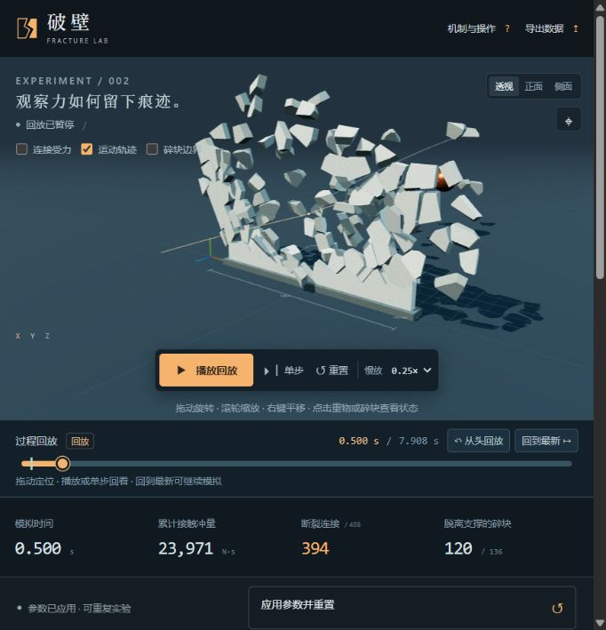

# 27 · 6Astra《破壁》三维物理模拟

*原项目测试截图（2026-10-02）。*

重物撞墙、断裂与碎块碰撞，可拖动时间轴回放全过程。

- [下载单文件 HTML](standalone.html)：打开文件页，点击 **Download raw file**，下载后用浏览器打开。
- [完整项目包](deliverables/breakwall-project.zip)：包含源码、依赖锁文件、许可与原测试记录。
- [原始提示词](PROMPT.md) · [后续请求原文](REQUEST_HISTORY.md)
- [完整使用说明](source/README.md) · [原项目测试记录](source/TEST_REPORT.md)

使用支持 WebGL 2、已开启硬件加速的现代桌面浏览器。调整实验参数后应用并重置，开始撞击；过程回放时间轴支持拖动、暂停、慢放、单步和回到最新继续模拟。采用预划分刚体和可断裂连接，属于交互物理实验，非工程级结构分析。

`standalone.html` 与原交付 HTML 逐字节一致，运行所需脚本和样式均已内嵌。新项目的 HTML 与预览图校验值记录在仓库索引中。

源码位于 `source/`，未包含 `node_modules`；重新构建前请按源码说明安装依赖。原聊天标题为“6Astra《破壁》三维物理模拟”，归档日期为 2026-10-02。此处保留的是原项目测试结果，本次归档未重新执行全部场景测试。
