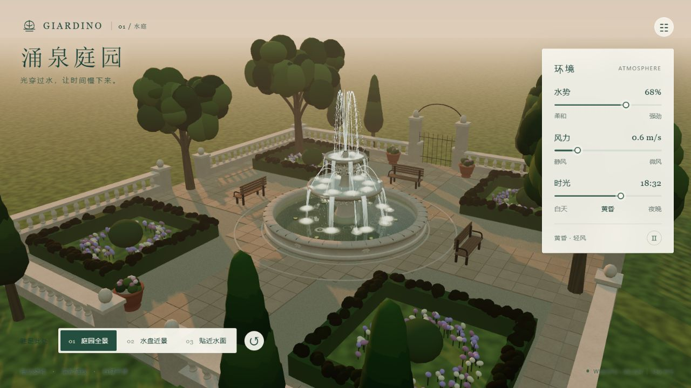

# 6Astra庭园喷泉场景

*原项目测试截图（2026-10-02）。*

古典多层喷泉与庭园，GPU 水流、涟漪及昼夜灯光。

- [下载单文件 HTML](standalone.html)：打开文件页，点击 **Download raw file**，下载后用浏览器打开。
- [完整项目包](deliverables/giardino-fountain.zip)：包含源码、依赖锁文件、许可与原测试记录。
- [原始提示词](PROMPT.md) · [后续请求原文](REQUEST_HISTORY.md)
- [完整使用说明](source/README.md) · [原项目测试记录](source/VERIFICATION.md)

需要支持 WebGPU 的浏览器与显卡驱动，并开启硬件加速。可调节水势、风力、时光和观察机位。浏览器若限制本地文件的 WebGPU，请在 source 目录运行 `npm run single`，访问终端显示的 localhost 地址。

`standalone.html` 与原交付 HTML 逐字节一致，运行所需脚本和样式均已内嵌。新项目的 HTML 与预览图校验值记录在仓库索引中。

源码位于 `source/`，未包含 `node_modules`；重新构建前请按源码说明安装依赖。原聊天标题为“6Astra庭园喷泉场景”，归档日期为 2026-10-02。此处保留的是原项目测试结果，本次归档未重新执行全部场景测试。
